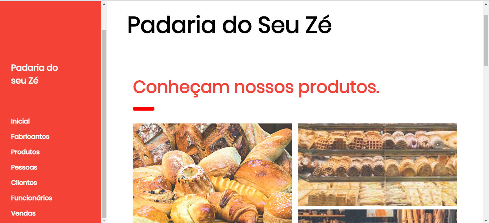

# Projeto Padaria feito para a disciplina de Java Web Fatec Ourinhos - SP
> Repositório dedicado ao projeto final da disciplina de java web, utilizando as técnologias (JSF-PRIMEFACES-JASPER-HIBERNATE-HTML-CSS-JAVASCRIPT-AJAX).

Para facilitar a compreensão o projeto foi dividido em pacotes 
* Bean - Essa especificação define uma API e dita regras de configuração e comunicação entre componentes e convenções de programação.
* Dao	- Abstrai e encapsula os mecanismos de acesso a dados escondendo os detalhes da execução da origem dos dados
* Domain - Classe onde é modelado as tabelas do projeto
* Util - Arquivos utéis, como por exemplo classes de conexao com banco de dados


Tela inicial do sistema


Tela de cadastro de produtos

## Instalação

Windows:

```sh
Instalar a IDE eclipe disponível em https://www.eclipse.org/downloads/
Clonar o projeto git clone https://github.com/andreluis7/Padaria-Primefaces.git
Importar projeto no eclipse e executar
Importante verificar a sua versão do mysql pois em alguns casos versões mais antigas podem não funcionar
Alterar configurações do banco de dados que estão no arquivo hibernate.cfg 
Caso rode local mudar para localhost e criar o banco padaria no banco de dados
```

## Configuração para Desenvolvimento

A aplicação não possui a necessidade de download de dependência para o seu completo funcionamento, apenas baixar e executar.

## Histórico de últimos commits

* (#23) 
    * Update hibernate.cfg para atender configs mysql do jelastic
* (#22) 
    * Adaptacoes necessarias para o novo layout
* (#21) 
    * Atualizacoes e correcoes
* (#20) 
    * Pasta target atualizada
* (#19) 
    * Deletado arquivos da pasta target
* (#18) 
    * Adicionado novo template

## Meta

André Luís – [@andreluis7](https://www.linkedin.com/in/andr%C3%A9-lu%C3%ADs-415480116/) – adrluis7@gmail.com

Distribuído sob a licença MIT. Veja `LICENSE` para mais informações.

[https://github.com/andreluis7](https://github.com/andreluis7)

## Contributing

1. Faça o _fork_ do projeto (<https://github.com/andreluis7/Curso-Logica-De-Programacao-Com-Java/fork>)
2. Crie uma _branch_ para sua modificação (`git checkout -b feature/fooBar`)
3. Faça o _commit_ (`git commit -am 'Add some fooBar'`)
4. _Push_ (`git push origin feature/fooBar`)
5. Crie um novo _Pull Request_

[npm-image]: https://img.shields.io/npm/v/datadog-metrics.svg?style=flat-square
[npm-url]: https://npmjs.org/package/datadog-metrics
[npm-downloads]: https://img.shields.io/npm/dm/datadog-metrics.svg?style=flat-square
[travis-image]: https://img.shields.io/travis/dbader/node-datadog-metrics/master.svg?style=flat-square
[travis-url]: https://travis-ci.org/dbader/node-datadog-metrics
[wiki]: https://github.com/seunome/seuprojeto/wiki
[wiki]: https://github.com/seunome/seuprojeto/wiki
